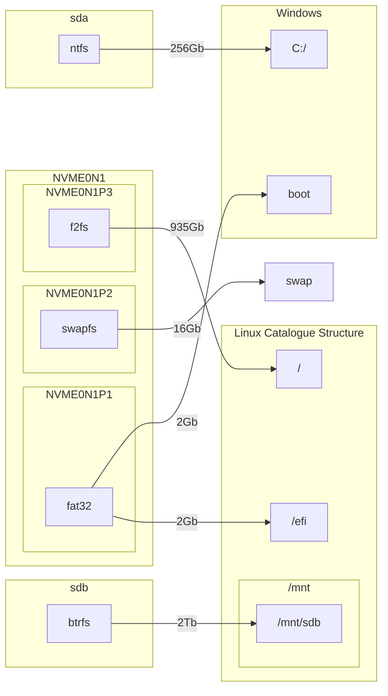

# Установка и настройки Arch Linux:
### Содержание:
- [Установка Arch Linux](Установка%20Achlinux.md)
- [Драйвера](/Драйвера)
- [Загрузчики](/Загрузчики)
- [Программы и игры](/Программы%20и%20игры)
- [Среды рабочего стола](/Среды%20рабочего%20стола)
- [Ядра](Ядра)
- [Дополнительные заметки](/Дополнительные%20заметки)

## Особенности:
- описана настройка pacman.conf
- описана установка 2 ядер. Одно основное, а второе запасное с базовыми настройками
- описана разметка корневого раздел и swap на зашифрованные разделы LUKS
- описана настройка UKI
- описана настройка и установка Nvidia или Nouveau драйверов на выбор 
- описана настройка и включение Secure boot
- описана встраивание ключей расшифровки LUKS в TPM модуль
- описана настройка PLYMOUTH
- описаны базовые настройки IPTABLES
- описана настройка Trim
- Описаны такие компоненты, как: AppArmor, UsbGuard, Maldet, Timeshift, ClamAv и др.

## Моя система:
#### Видеокарта: NVIDIA архитектура Turing
#### Процессор: AMD архитектура Zen2
#### Разметка дисков:

