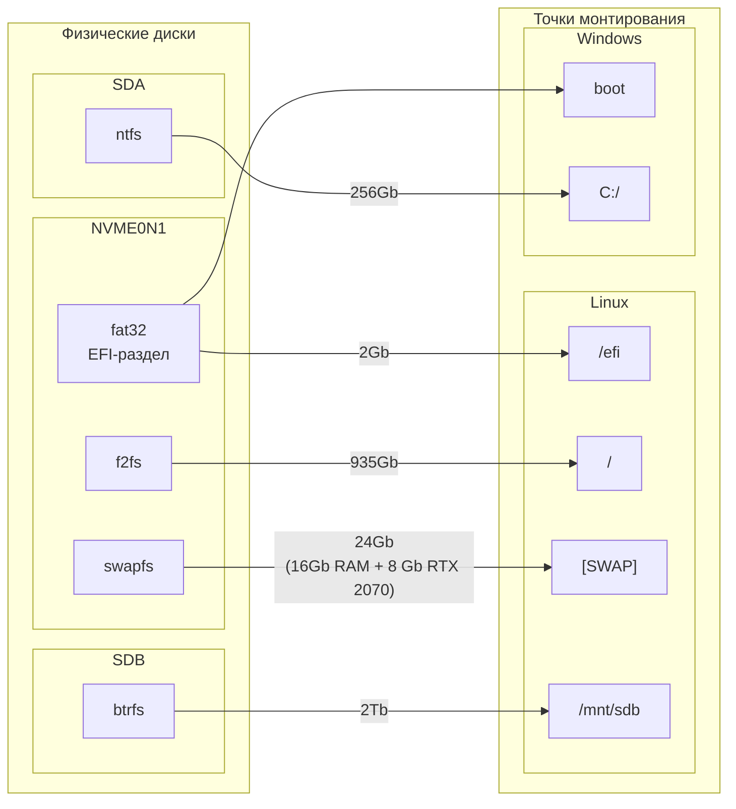

# Установка и настройка Arch Linux:
### Содержание:
- [Устанавливаем Arch Linux](Установка%20Achlinux.md)
- [Настраиваем драйвера](/Драйвера)
- [Настраиваем загрузчики](/Загрузчики)
- [Устанавливаем программы и игры](/Программы%20и%20игры)
- [Настраиваем среды рабочего стола](/Среды%20рабочего%20стола)
- [Работаем с ядрами](Ядра)
- [Дополнительные заметки](/Дополнительные%20заметки)

## Особенности:
- Описана настройка pacman.conf.
- Описана установка двух ядер: одно основное и одно запасное с базовыми настройками.
- Описана разметка корневого раздела и swap на зашифрованные разделы LUKS.
- Описана настройка UKI.
- Описана настройка и установка драйверов Nvidia или Nouveau на выбор.
- Описана настройка и включение Secure Boot.
- Описано встраивание ключей расшифровки LUKS в TPM модуль.
- Описана настройка PLYMOUTH.
- Описаны базовые настройки IPTABLES.
- Описана настройка Trim.
- Описаны такие компоненты, как AppArmor, UsbGuard, Maldet, Timeshift, ClamAv и др.

## Моя система:
#### Видеокарта: NVIDIA архитектура Turing
#### Процессор: AMD архитектура Zen2
#### Разметка дисков:

