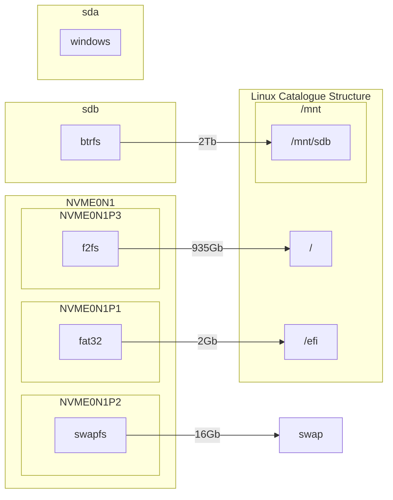

# Моя система:
#### Видеокарта: NVIDIA
#### Процессор: AMD
#### Диски:


# Система Arch, особенности:
##### - Раскомментированы все тестовые и 32 битные репозитории пакетов
##### - Добавлено LQX ядро
#### - Корневой раздел и swap на зашифрованных разделах LUKS
#### - Загрузка ядер, модулей и т.п. происходить через UKI из efi раздела
#### - Установлены твики для драйверов nvidia
#### - Настроен и включён Secure boot
#### - Ключ расшифровки раздела с LUKS прописан в tpm
#### - Настроен PLYMOUTH (временно отключён)
#### - Настроены IPTABLES
#### - Включен Trim
#### - AppArmor
#### - Timeshift

## Обозначения:
### Машина-клиент -- машина, на которую устанавливают систему
### Машина-настройщик -- машина, через которую устанавливают систему по ssh

# Часть 0. Настройка UEFI
**1) Если решили заново настроить и нет уже готовых ключей для подписи, то убеждаемся, что Secure-boot сброшен и ключи пусты (Не вернувшиеся в дефолтное состояние, а именно пустые)**
**2) Проверяем, что для не подписанного arch iso был отключён Secure-boot**
**3) Проверяем, что TPM включён**
# Часть 1. Настройка SSH

#### Установка через ssh позволяет сразу копировать готовые команды
**На машине-клиент устанавливаем пароль:**
```bash
passwd
```
**На машине-клиент узнаём ip его локальный ip(Будет примерно 192.168.1.111):**
```bash
ip -br a
```
**Далее на машине-настройщике подключаемся по ssh к машине-клиенту**
```bash
ssh root@<ip машины-клиента, который узнали выше>
```
# Часть 2. Подготовка дисков:
## Удаление данных с диска:
```bash
wipefs -a /dev/nvme0n1
```

## Создание разметки и разделов:
**Размечаем диск в gpt:**
```bash
parted /dev/nvme0n1 mklabel gpt
```
**Создаём 2 раздела:**
```bash
parted /dev/nvme0n1 mkpart '"EFI system partition"' fat32 2048s 2GiB && \
parted /dev/nvme0n1 mkpart '"swap partition"' 2GiB 16GiB && \
parted /dev/nvme0n1 mkpart '"system partition"' 16GiB 100%
```
>[!Info]
>Очень важно, следите за размером секторов на диске! От этого зависит скорость доступа к диску. Если при создании раздела не соблюсти кратность сектора, то контроллер будет чаще обращаться к ячейкам, а значит увеличится и время доступа к данным. В данном случае, минимальный разрешённый сектор у меня 2048s(секторов).
>Дополнительно тут: https://wiki.archlinux.org/title/Parted_(%D0%A0%D1%83%D1%81%D1%81%D0%BA%D0%B8%D0%B9)#%D0%92%D1%8B%D1%80%D0%B0%D0%B2%D0%BD%D0%B8%D0%B2%D0%B0%D0%BD%D0%B8%D0%B5

>[!Info]
>Ещё интересная вещь, это указание размера разделов в процентах. Она очень удобна, когда нужно указать раздел от начала 0% или до конца 100%

**Назначаем флаги для разделов (необязательно, но пусть будет):**
```bash
parted /dev/nvme0n1 set 1 esp on && \
parted /dev/nvme0n1 set 2 swap on
```
**Форматирование раздела под efi:**
```bash
mkfs.fat -F32 /dev/nvme0n1p1
```
## LUKS шифрование разделов:
LUKS шифрование даёт нам раздел, который полностью закрыт для просмотра, делая из раздела, по сути один большой файл. Его структура похожа на структуру обычного диска с разметкой диска, только вместо разметки диска, у нас заголовок LUKS и ещё есть отдельный раздел для хранения ключей, за счёт чего в LUKS  можно удобно менять пароли (в отличии от того же dm-decrypt, где ключ выбирается один на все файлы)
Подробнее о моём варианте шифрования можно почитать тут:
https://wiki.archlinux.org/title/Dm-crypt/Encrypting_an_entire_system#LVM_on_LUKS
**Проверяем модули на работоспособность:**
```bash
modprobe dm-crypt && \
modprobe dm-mod
```
**Шифруем swap раздел:**
```bash
cryptsetup -v luksFormat -s 512 -h sha512 /dev/nvme0n1p2
```
**Шифруем root раздел в SHA 512:**
```bash
cryptsetup -v luksFormat -s 512 -h sha512 /dev/nvme0n1p3
```
**Открываем зашифрованные разделов:**
```bash
cryptsetup luksOpen /dev/nvme0n1p2 swap && \
cryptsetup luksOpen /dev/nvme0n1p3 root
```
**Экспортируем UUID дисков в переменные:**
```bash
export NVME0N1P1=$(lsblk -dno UUID /dev/nvme0n1p1) \
NVME0N1P2=$(lsblk -dno UUID /dev/nvme0n1p2) \
NVME0N1P3=$(lsblk -dno UUID /dev/nvme0n1p3)
```
**Экспортируем адреса зашифрованных контейнеров:**
```bash
export ROOT=/dev/mapper/root \
SWAP=/dev/mapper/swap
```
## Создание файловых систем в томах:
**Создание файловой системы swap:** 
```bash
mkswap -L swap $SWAP
```
**Создание файловой системы f2fs:**
```bash
mkfs.f2fs -f -O extra_attr,inode_checksum,sb_checksum,compression  $ROOT
```
>[!Info]
>Для подробностей нужно идти на Archwiki, но тут, как минимум включена полезная компрессия
>Подробнее тут: https://wiki.archlinux.org/title/F2FS#Compression
>
## Монтирование разделов:
**Обновление информации о дисках:**
```bash
systemctl daemon-reload
```
**Монтирование корневого раздела:**
```bash
mount -o compress_algorithm=zstd:6,compress_chksum,gc_merge,lazytime $ROOT /mnt
```
>[!Info]
>Раздел смонтирован с рекомендуемыми Archwiki параметрами
>Подбробнее тут: https://wiki.archlinux.org/title/F2FS#Recommended_mount_options 

**Монтирование swap:**
```bash
swapon $SWAP
```
**Монтирование efi раздела:**
```bash
mount --mkdir -o uid=0,gid=0,fmask=0137,dmask=0027  /dev/nvme0n1p1 /mnt/efi
```
>[!Info]
>Делаем маску 0077, ради того, чтобы из под обычного пользователя не было доступа к этому разделу. Собственно, systemd-boot при установке про это и говорит
>``` bash
!Mount point '/boot' which backs the random seed file is world accessible, which is a security hole! !  
! Random seed file '/boot/loader/random-seed' is world accessible, which is a security hole! ! ```

**Мой дополнительный диск:**
```bash
mount --mkdir /dev/sdb /mnt/mnt/sdb
>```
# Часть 3. Установка до подмены корневого раздела:

**Подбор зеркал:**
Зачастую, стандартный подбор зеркал является неоптимальным. Поэтому с помощью reflector зеркала отсортируем по скорости и типу и сохраним их
```bash
reflector --verbose -l 5 -p https --sort rate --save /etc/pacman.d/mirrorlist
```
**Установка базовых пакетов:**
```bash
pacstrap -K /mnt base base-devel git vi neovim mkinitcpio reflector
```
**Генерирование FSTAB:**
```bash
genfstab -U /mnt > /mnt/etc/fstab
```
**Переход в CHROOT:**
```bash
arch-chroot /mnt
```
# Часть 4. Настройка в подменённом корневом разделе: 
### Установка времени:
**Установка своего часового пояса:**
```bash
ln -sf /usr/share/zoneinfo/Europe/Kaliningrad /etc/localtime
```
>[!Info]
>Здесь выбираем собственный часовой пояс
**Синхронизация:**
```bash
hwclock --systohc
```
### Установка локалей:
**Установка eng локали:**
```bash
sed '/en_US.UTF-8 UTF-8/s/^#//' -i /etc/locale.gen
```
**Установка ru локали:**
```bash
sed '/ru_RU.UTF-8 UTF-8/s/^#//' -i /etc/locale.gen
```
**Генерация:**
```bash
locale-gen
```
**Установка языка по умолчанию:**
```bash
echo LANG=ru_RU.UTF-8 >> /etc/locale.conf
```
**Установка шрифтов**
```bash
cat <<- _EOF_ > /etc/vconsole.conf
	KEYMAP=ruwin_alt_sh-UTF-8
	FONT=cyr-sun16
_EOF_
```
>[!Info]
>ruwin_alt_sh-UTF-8 раскладка, в отличии от раскладки, предлагаемой в "Installation guide" даёт возможность в режиме терминала менять раскладку через alt + shift
#### Создание хоста:
**Создание имени хоста:**
```bash
echo "arch" >> /etc/hostname
```
**Создание внутренней сети хоста:**
```bash
cat << _EOF_ >> /etc/hosts
127.0.0.1		localhost
::1			localhost
127.0.1.1		arch.localdomain	arch
_EOF_
```
### Создание пользователя:
**Создание пароля для root:**
```bash
passwd
```
**Добавляем пользователя:**
```bash
useradd -mG wheel vlad
```
**Делаем бэкап файла:**
```bash
cp /etc/sudoers /etc/sudoers.backup
```
**Редактируем сам sudoers:**
```bash
sed '/\%wheel ALL=(ALL:ALL) ALL/s/^# //' -i /etc/sudoers
```
**Проверяем на правильность:**
```bash
visudo -c /etc/sudoers
```
**Если всё хорошо, то удаляем бэкап:**
```bash
rm /etc/sudoers.backup
```
**Добавляем пароль для пользователя:**
```bash
passwd vlad
```

## Настройка компилятора и пакетного менеджера:
**Для мнимой производительности корректируем флаги GCC:**
```bash
sed -i 's/-march=x86-64/-march=native/' /etc/makepkg.conf && \
sed -i 's/-mtune=generic/-mtune=native/' /etc/makepkg.conf && \
sed -i 's/#RUSTFLAGS="-C opt-level=2"/RUSTFLAGS="-C opt-level=3"/' /etc/makepkg.conf && \
sed -i 's/#MAKEFLAGS="-j2"/MAKEFLAGS="-j$(nproc) -l$(nproc)"/' /etc/makepkg.conf && \
sed -i 's/\!lto/lto/g' /etc/makepkg.conf
```
>[!Info]
>Все эти флаги взяты отсюда:
>https://ventureo.codeberg.page/v2022.07.01/source/generic-system-acceleration.html#makepkg-conf

### PARU:
Отличительной особенностью PARU является одновременно и то что он написан на Rust и то что он позволяет достаточно удобно работать с PKGBUILD 
**Скачиваем PARU и входим в его каталог:**
```bash
sudo -u vlad git clone https://aur.archlinux.org/paru.git /home/vlad/bin/paru && \
cd /home/vlad/bin/paru/
```
**Создаём пакет, устанавливаем его и переходим обратно в корень**
```bash
sudo -u vlad makepkg -si && \
cd /
```

**Добавляем возможность редактирования в paru:**
```bash
sed '/\[bin\]/s/^#//' -i /etc/paru.conf && \
sed '/FileManager/s/^#//' -i /etc/paru.conf
sed '/FileManager/s/vifm$/nvim/' -i /etc/paru.conf
```
**Заставляем paru держать таймер истечения действия пароля до полного выполнения работы:**
```bash
sed '/SudoLoop/s/^#//' -i /etc/paru.conf
```
### Добавление своего стека репозиториев:
**Делаем копию pacman.conf:**
```bash
cp /etc/pacman.conf /etc/pacman.conf.backup
```
**В /etc/pacman.conf раcкомментируем тестовые репозитории:**
```bash
sed '/Color/s/^#//' -i /etc/pacman.conf && \
sed '/\[core-testing\]/{s/^#//;n;s/^#//;}' -i /etc/pacman.conf && \
sed '/\[extra-testing\]/{s/^#//;n;s/^#//;}' -i /etc/pacman.conf && \
sed '/\[multilib-testing\]/{s/^#//;n;s/^#//;}' -i /etc/pacman.conf && \
sed '/\[multilib\]/{s/^#//;n;s/^#//;}' -i /etc/pacman.conf && \
sed '/\[core-testing\]/i\
\
# Default repositories\
' -i /etc/pacman.conf
```
**Раcкомментируем параллельные загрузки:**
```bash
sed '/ParallelDownloads =/s/^#//' -i /etc/pacman.conf
```

**Добавляем репозитории которые Вам нужны:**
Объявление через комментарий о участке со своими репозиториями
```bash
sed -i "/# after the header, and they will be used before the default mirrors./{ 
n
n
a\\
#Custom\ repositories\n
}" -i /etc/pacman.conf
```
ALHP репозиторий (Репозиторий скомпилированный под 86-64-v3 архитектуру)
Обязательно! Перед добавлением в pacman.conf добавляем ключи и зеркала alhp из AUR:
```bash
sudo -u vlad paru -Sy alhp-keyring alhp-mirrorlist
```

Уже потом добавляем в pacman.conf:
```bash
sed '/# Default repositories/i\
\# ALHP\
\[core-x86-64-v3\]\
Include = /etc/pacman.d/alhp-mirrorlist\
\
\[extra-x86-64-v3\]\
Include = /etc/pacman.d/alhp-mirrorlist\
' -i /etc/pacman.conf
```

>[!Info]
>Репозитории написаны в порядке моего приоритета. С каждым новым вводом, следующий репозиторий будет записываться в конец списка

>[!Info]
>Следите за очерёдностью репозиториев. Репозитории расположенные вверху имеют приоритет перед нижними

### Обновление ключей и репозиториев:
Обновляем зеркала по скорости уже в chroot:
```bash
reflector --verbose -l 5 -p https --sort rate --save /etc/pacman.d/mirrorlist
```
**Инициализация:**
```bash
sudo -u vlad paru -Sy archlinux-keyring && sudo -u vlad paru -Su
```
### Добавление пакетов: 
**Скачиваем необходимые пакеты. Микрокод, f2fs пакеты, менеджер сети, менеджер efiboot, lvm2 и дополнительные шрифты:**
```bash
sudo -u vlad paru -S --needed wget man f2fs-tools amd-ucode \
 efibootmgr networkmanager bluez pipewire pipewire-alsa noto-fonts-cjk ttf-hannom \
 wl-clipboard
```
#### Установка HOOK для микроядра:
**Если папка не создалась, то создать:**
```bash
mkdir /etc/pacman.d/hooks
```
**Hook для для раннего обновления микрокода в mkinitcpio:**
```bash
cat << _EOF_ > /etc/pacman.d/hooks/ucode.hook
[Trigger]
Operation=Install
Operation=Upgrade
Operation=Remove
Type=Package
# Change to appropriate microcode package
Target=amd-ucode
# Change the linux part above and in the Exec line if a different kernel is used
Target=linux*

[Action]
Description=Update Microcode module in initcpio
Depends=mkinitcpio
Depends=sbctl
When=PostTransaction
NeedsTargets
Exec=/bin/sh -c 'while read -r trg; do case \$trg in linux*) exit 0; esac; done; /usr/bin/mkinitcpio -P; /usr/bin/sbctl sign-all'
_EOF_
```
>[!Warning]
>Позднее обновление микрокода, начиная с ядра 5.19 стало небезопасным и по умолчанию оно отключено. Поэтому часть про позднее обновление я удалил.
>(Написал, чтобы не забыть и опять не выписать из переведённого вики)
## Первоначальная настройка:
### Включение сеть и bluetooth:
**Включаем юнит менеджера сети и bluetooth:**
```bash
systemctl enable NetworkManager.service && \
systemctl enable bluetooth.service
```
### Редактирование MKINITCPIO:
**Копируем mkinitcpio.conf в mkinitcpio.conf.d:**
```bash
cp /etc/mkinitcpio.conf /etc/mkinitcpio.conf.d/mkinitcpio.conf 
```

**Редактировать hook mkinitcpio и включаем туда модули systemd и после block хуки sd encrypt и resume:**
```bash
sed -i '/^HOOKS=/ s/udev/systemd/' /etc/mkinitcpio.conf.d/mkinitcpio.conf  && \
sed -i '/^HOOKS=/ s/keymap consolefont/sd-vconsole/' /etc/mkinitcpio.conf.d/mkinitcpio.conf && \
sed -i "/^HOOKS=/ s/\(block\)\(.*\)$/\1 sd-encrypt resume\2/" /etc/mkinitcpio.conf.d/mkinitcpio.conf
```
**Добавляем /etc/crypttab.initramfs: **
```bash
cat << _EOF_ > /etc/crypttab.initramfs
# Mount /dev/mapper/swap re-encrypting it with a fresh key each reboot
swap UUID=$NVME0N1P2 none timeout=180,tpm2-device=auto,discard
# Mount /dev/mapper/root with the key from TPM
root UUID=$NVME0N1P3 none timeout=180,tpm2-device=auto,discard
_EOF_
```
### Установка SECURE BOOT:
```bash
sudo -u vlad paru -S  sbctl
```
**Проверяем, что secure boot в setup mode: Enabled (нужно удалить старые ключи из биоса):**
```bash
sbctl status
```
**Создаём свои ключи:**
```bash
sbctl create-keys
```
**Создаём свои ключи и добавляем ключи Microsoft (для поддержки windows и вшитых устройств у некоторых материнок):**
```bash
sbctl enroll-keys --microsoft
```
>[!Info]
>Если secure boot не очищенный, UEFI не даст накатить ключи. Если до этого Secure boot был забыт, можно пока пропустить этот шаг. При перезагрузке удалить ключи и уже потом накатывать
## Ядра:
### Установка UKI:

**Добавить опции основного ядра в cmdline:**
```bash
cat << _EOF_ > /etc/kernel/cmdline
options page_alloc.shuffle=1 root=$ROOT rootflags=atgc resume=$SWAP rw
_EOF_
```
>[!Info]
>**page_alloc.shuffle=1** - Этот параметр рандомизирует свободные списки
> распределителя страниц. Улучшает производительность при работе с ОЗУ с очень быстрыми накопителями (NVMe, Optane). Подробнее [тут](https://git.kernel.org/pub/scm/linux/kernel/git/torvalds/linux.git/commit/?id=e900a918b0984ec8f2eb150b8477a47b75d17692).
>Доп. информация здесь: https://ventureo.codeberg.page/source/kernel-parameters.html
>**root=** - опция, указывающая какой раздел грузить как root (в данном случае это логический диск)
>resume= -опция, показывающий системе swap раздел, необходимый при сне.
>**rootflags=atgc** - опцию, которую я не расшифровал, но тут написано зачем оно:https://wiki.archlinux.org/title/F2FS#Remounting_impossible_with_some_options
>**rw** - разрешение на чтение запись раздела

**Добавим опции для вспомогательного ядра (В итоге, он как запасной имеет минимальные для загрузки параметры, например будет в дальнейшем без plymouth параметров):**
```bash
cat << _EOF_ > /etc/kernel/cmdline-base
options page_alloc.shuffle=1 root=$ROOT rootflags=atgc resume=$SWAP rw
_EOF_
```
**Для каждого ядра изменить пресеты( например, в linux.preset будет cmdline-base):**
```bash
cat << _EOF_ > /etc/mkinitcpio.d/linux-lts.preset
# mkinitcpio preset file for the 'linux' package

ALL_config="/etc/mkinitcpio.conf.d/mkinitcpio.conf"
ALL_kver="/boot/vmlinuz-linux-lts"
ALL_microcode=(/boot/*-ucode.img)

PRESETS=('default' 'fallback')

#default_config="/etc/mkinitcpio.conf.d/mkinitcpio.conf"
#default_image="/boot/initramfs-linux-lts.img"
default_uki="/efi/EFI/Linux/arch-linux-lts.efi"
default_options="--cmdline /etc/kernel/cmdline-base"

#fallback_config="/etc/mkinitcpio.conf.d/mkinitcpio.conf"
#fallback_image="/boot/initramfs-linux-lts-fallback.img"
fallback_uki="/efi/EFI/Linux/arch-linux-lts-fallback.efi"
fallback_options="-S autodetect"
_EOF_
```

```bash
cat << _EOF_ > /etc/mkinitcpio.d/linux-lqx.preset
# mkinitcpio preset file for the 'linux-lqx' package

ALL_config="/etc/mkinitcpio.conf.d/mkinitcpio.conf"
ALL_kver="/boot/vmlinuz-linux-lqx"
ALL_microcode=(/boot/*-ucode.img)

PRESETS=('default' 'fallback')

#default_config="/etc/mkinitcpio.conf.d/mkinitcpio.conf "
#default_image="/boot/initramfs-linux-lqx.img"
default_uki="/efi/EFI/Linux/arch-linux-lqx.efi"
default_options="--cmdline /etc/kernel/cmdline"

#fallback_config="/etc/mkinitcpio.conf.d/mkinitcpio.conf "
#fallback_image="/boot/initramfs-linux-lqx-fallback.img"
fallback_uki="/efi/EFI/Linux/arch-linux-lqx-fallback.efi"
fallback_options="-S autodetect"
_EOF_
```

Если планируется обычное linux ядро, то и это:
```bash
cat << _EOF_ > /etc/mkinitcpio.d/linux.preset
# mkinitcpio preset file for the 'linux' package

ALL_config="/etc/mkinitcpio.conf.d/mkinitcpio.conf"
ALL_kver="/boot/vmlinuz-linux"
ALL_microcode=(/boot/*-ucode.img)

PRESETS=('default' 'fallback')

#default_config="/etc/mkinitcpio.conf.d/mkinitcpio.conf "
#default_image="/boot/initramfs-linux.img"
default_uki="/efi/EFI/Linux/arch-linux.efi"
default_options="--cmdline /etc/kernel/cmdline"

#fallback_config="/etc/mkinitcpio.conf.d/mkinitcpio.conf "
#fallback_image="/boot/initramfs-linux-fallback.img"
fallback_uki="/efi/EFI/Linux/arch-linux-fallback.efi"
fallback_options="-S autodetect"
_EOF_
```
Если планируется  linux-zen ядро, то и это:
```bash
cat << _EOF_ > /etc/mkinitcpio.d/linux-zen.preset
# mkinitcpio preset file for the 'linux-zen' package

ALL_config="/etc/mkinitcpio.conf.d/mkinitcpio.conf"
ALL_kver="/boot/vmlinuz-linux-zen"
ALL_microcode=(/boot/*-ucode.img)

PRESETS=('default' 'fallback')

#default_config="/etc/mkinitcpio.conf.d/mkinitcpio.conf "
#default_image="/boot/initramfs-linux-zen.img"
default_uki="/efi/EFI/Linux/arch-linux-zen.efi"
default_options="--cmdline /etc/kernel/cmdline"

#fallback_config="/etc/mkinitcpio.conf.d/mkinitcpio.conf "
#fallback_image="/boot/initramfs-linux-zen-fallback.img"
fallback_uki="/efi/EFI/Linux/arch-linux-zen-fallback.efi"
fallback_options="-S autodetect"
_EOF_
```
Если планируется  linux-mainline ядро, то и это:
```bash
cat << _EOF_ > /etc/mkinitcpio.d/linux-mainline.preset
# mkinitcpio preset file for the 'linux-mainline' package

ALL_config="/etc/mkinitcpio.conf.d/mkinitcpio.conf"
ALL_kver="/boot/vmlinuz-linux-mainline"
ALL_microcode=(/boot/*-ucode.img)

PRESETS=('default' 'fallback')

#default_config="/etc/mkinitcpio.conf.d/mkinitcpio.conf "
#default_image="/boot/initramfs-linux-mainline.img"
default_uki="/efi/EFI/Linux/arch-linux-mainline.efi"
default_options="--cmdline /etc/kernel/cmdline"

#fallback_config="/etc/mkinitcpio.conf.d/mkinitcpio.conf "
#fallback_image="/boot/initramfs-linux-mainline-fallback.img"
fallback_uki="/efi/EFI/Linux/arch-linux-mainline-fallback.efi"
fallback_options="-S autodetect"
_EOF_
```
Если планируется  linux-git ядро, то и это:
```bash
cat << _EOF_ > /etc/mkinitcpio.d/linux-git.preset
# mkinitcpio preset file for the 'linux-git' package

ALL_config="/etc/mkinitcpio.conf.d/mkinitcpio.conf"
ALL_kver="/boot/vmlinuz-linux-git"
ALL_microcode=(/boot/*-ucode.img)

PRESETS=('default' 'fallback')

#default_config="/etc/mkinitcpio.conf.d/mkinitcpio.conf "
#default_image="/boot/initramfs-linux-git.img"
default_uki="/efi/EFI/Linux/arch-linux-git.efi"
default_options="--cmdline /etc/kernel/cmdline"

#fallback_config="/etc/mkinitcpio.conf.d/mkinitcpio.conf "
#fallback_image="/boot/initramfs-linux-git-fallback.img"
fallback_uki="/efi/EFI/Linux/arch-linux-git-fallback.efi"
fallback_options="-S autodetect"
_EOF_
```
Если планируется  linux-hardened ядро, то и это:
```bash
cat << _EOF_ > /etc/mkinitcpio.d/linux-hardened.preset
# mkinitcpio preset file for the 'linux-hardened' package

ALL_config="/etc/mkinitcpio.conf.d/mkinitcpio.conf"
ALL_kver="/boot/vmlinuz-linux-hardened"
ALL_microcode=(/boot/*-ucode.img)

PRESETS=('default' 'fallback')

#default_config="/etc/mkinitcpio.conf.d/mkinitcpio.conf "
#default_image="/boot/initramfs-linux-hardened.img"
default_uki="/efi/EFI/Linux/arch-linux-hardened.efi"
default_options="--cmdline /etc/kernel/cmdline"

#fallback_config="/etc/mkinitcpio.conf.d/mkinitcpio.conf "
#fallback_image="/boot/initramfs-linux-hardened-fallback.img"
fallback_uki="/efi/EFI/Linux/arch-linux-hardened-fallback.efi"
fallback_options="-S autodetect"
_EOF_
```
**Устанавливаем сами ядра :**
```bash
sudo -u vlad paru -S --needed linux-lqx linux-lqx-headers linux-lqx-docs linux-lts linux-lts-docs linux-lts-headers mkinitcpio-firmware
```

>[!Note]
>Ставлю только linux-lqx-headers, т.к linux-lqx-headers и linux-lqx-docs подтягивают linux-lqx
>(Но нужно попробовать с этим пожить. Возможно лучше будет отдельно linux-lqx ставить)

>[!linux-lqx ядро]
>Так как я хочу самостоятельно компилировать ядро, я добавил в paru возможность редактировать PKGBUILD.
>Тогда при использовании репозитория AUR скачивается версия ядра, которую нужно ещё скомпилировать.
>Когда paru дойдёт до linux-lqx, нам предложат изменить PKGBUILD. Меняем его и добавляем к _menunconfig= символ **y** 
>( Будет **_menunconfig=y**)
>Далее выбираем необходимые флаги. В моём случае:
> - Выбираем платформу zen2
> - Отключаем Kernel Debugging
> - В General Setup внутренние параметры удаляем audit=0  (Если хотим использовать Apparmor с аудитом)
> - В Security выбираем Apparmor
> - В LSM вписываем строку landlock,lockdown,yama,integrity,apparmor,bpf
>И продолжаем установку F9
>TODO: точно указать расположение этих флагов
>И продолжаем установку

> [!INFO]
>Для того, чтобы mkinitcpio не делал предупреждений о отсутствующих модулях, я поставил
>этот пакет(Но это не обязательно т.к. оно ни на что не влияет):
>https://wiki.archlinux.org/title/Mkinitcpio#Possibly_missing_firmware_for_module_XXXX
**Подбор зеркал в chroot:**
Cортируем по скорости и типу уже в chroot:
### Подпись файлов efi созданными ключами:
**Подписываем linux efi приложения с зашитыми ядрами, модулями, конфигами и т.п.:**
```bash
sbctl sign -s /efi/EFI/Linux/arch-linux-lts.efi && \
sbctl sign -s /efi/EFI/Linux/arch-linux-lts-fallback.efi && \
sbctl sign -s /efi/EFI/Linux/arch-linux-lqx.efi && \
sbctl sign -s /efi/EFI/Linux/arch-linux-lqx-fallback.efi && \
sbctl sign -s /efi/EFI/Linux/arch-linux.efi && \
sbctl sign -s /efi/EFI/Linux/arch-linux-fallback.efi
```
> [!INFO]
> sbctl создаёт после этого hook, который будет постоянно их подписывать)

## **Настройки для видеокарты NVIDIA:**
Если видеокарта не имеет type-c, чтобы избавиться от ошибок можно его замутить
**Добавляем в modprobe.d:**
```bash
cat << _EOF_ > /etc/modprobe.d/blacklist_i2c.conf
blacklist i2c_nvidia_gpu
#
# If the video card does not have type-c, and support is included in the drivers, then you can mute it
_EOF_
```
### [[NVIDIA]]
### [[Nouveau]]

## Загрузчики:
### [[Systemd-boot]]
## [[GRUB]]
## [[Запись UKI в UEFI]]
## Пересобираем ядра уже в EFI:
```bash
mkinitcpio -P ; sbctl sign-all
```
### Подпись файлов efi созданными ключами:
**Подписываем Windows файлы:**
```bash
sbctl sign -s /efi/EFI/Boot/bootx64.efi
```

## UEFI приложения:
### memtest86:
**Установка:**
```bash
sudo -u vlad paru -S memtest86-efi     
```
**Запускаем скрипт установки и следуем инструкциям:**
```bash
memtest86-efi --install
```
**Подписываем:**
```bash
sbctl sign -s /efi/EFI/memtest86/memtestx64.efi
```
**Добавляем триггер для подписи memtest86 при его обновлении:**
```bash
cat << _EOF_ >> /etc/pacman.d/hooks/sign-memtest86-secureboot.hook
[Trigger]
Operation = Install
Operation = Upgrade
Type = Path
Target = /efi/EFI/memtest86/memtestx64.efi

[Action]
When = PostTransaction
Exec = /usr/bin/sbctl sign-all
Depends = sbctl
_EOF_
```
### fwupd:
**Установка:**
```bash
sudo -u vlad paru -S --needed fwupd
```
**Подписываем:**
```bash
sbctl sign -s /usr/lib/fwupd/efi/fwupdx64.efi
```
**Добавляем триггер для подписи fwupd при его обновлении:**
```bash
cat << _EOF_ >> /etc/pacman.d/hooks/sign-fwupd-secureboot.hook
[Trigger]
Operation = Install
Operation = Upgrade
Type = Path
Target = /usr/lib/fwupd/efi/fwupdx64.efi

[Action]
When = PostTransaction
Exec = /usr/bin/sbctl sign-all
Depends = sbctl
_EOF_
```
## Постзагрузка:
>[!Warning]
>Часть инструкций ломает внешние шрифты. Пока не добавлять при установке
### Plymouth:
**В cmdline добавить:**
```bash
sed -i -e 's/$/ loglevel=3 quite splash rd.udev.log_priority=3 vt.global_cursor_default=0/' /etc/kernel/cmdline
```
**В hook в mkinitcpio после udev вставить plymouth:**
```bash
sed -i "/^HOOKS=/ s/\(systemd\)\(.*\)$/\1 plymouth\2/" /etc/mkinitcpio.conf.d/mkinitcpio.conf 
```
> [!INFO]
> У nvidia plymouth появляется довольно поздно и это нормально. 
> Всё из-за поздней загрузки kms
### Настройка plymouth:
**Установка пакетов:**
```bash
sudo -u vlad paru -S plymouth plymouth-theme-arch-bgrt
```
**Выбираем тему arch-bqrt:**
```
plymouth-set-default-theme -R arch-bgrt
```
## Начало настройки рабочего окружения:

#### Украшаем окно приветствия:
```bash
cat << _EOF_ >> /etc/issue
 \e[H\e[2J
           \e[1;36m.
          \e[1;36m/#\
         \e[1;36m/###\      \e[1;37m               #     \e[1;36m| *
        \e[1;36m/p^###\     \e[1;37m a##e #%" a#"e 6##%  \e[1;36m| | |-^-. |   | \ /
       \e[1;36m/##P^q##\    \e[1;37m.oOo# #   #    #  #  \e[1;36m| | |   | |   |  X
      \e[1;36m/##(   )##\   \e[1;37m%OoO# #   %#e" #  #  \e[1;36m| | |   | ^._.| / \ \e[0;37mTM
     \e[1;36m/###P   q#,^\
    \e[1;36m/P^         ^q\ \e[0;37mTM
_EOF_
```
https://wiki.archlinux.org/title/ASCII_art
```bash
cat << _EOF_ > /etc/issue
fortune -a | fmt -80 -s | $(shuf -n 1 -e cowsay cowthink) -$(shuf -n 1 -e b d g p s t w y) -f $(shuf -n 1 -e $(cowsay -l | tail -n +2)) -n
_EOF_
```
### Avahi

>[!Info]
Компонент тоже важный. Вообще в системе уже стоит systemd-resolved,но avahi устанавливается неявно вместе с pipewire, поэтому, отмечаю его отдельно, чтобы не потерялcя
Что это: Avahi is a free Zero-configuration networking (zeroconf) implementation, including a system for multicast DNS/DNS-SD service discovery. It allows programs to publish and discover services and hosts running on a local network with no specific configuration. For example you can plug into a network and instantly find printers to print to, files to look at and people to talk to. It is licensed under the GNU Lesser General Public License (LGPL).

>[!Что он делает:]
Avahi provides local hostname resolution using a "hostname.local" naming scheme.

**Установка:**
```bash
sudo -u vlad paru -S --needed avahi nss-mdns
```

**Отключаем systemd-resolved:**
```bash
systemctl disable systemd-resolved.service
```
**Включаем avahi-daemon.service:**
```bash
systemctl enable avahi-daemon.service
```

>[!Info]
Есть аналог от systemd — systemd-resolved, но, т.к. pipewire в зависимостях требует именно avahi, и какого-то отдельного смысла в systemd-resolved нет (Кроме как убрать иконки avahi из DE), я не буду его заменять.
Плюс у systemd-resolved, в отличии от Avahi есть ограничения, например он имеет ограниченный resolvconf  интерфейс, и может много что с ним не работать.
### AppArmor
**Устанавливаем сам apparmor (audit тоже качает ):**
```bash
sudo -u vlad paru -S apparmor
```
**Запускаем юнит apparmor:**
```bash
systemctl enable apparmor.service
```
>[!Info]
Прежде всего нужно убедиться, что ядро поддерживает apparmor

**Прописываем параметры ядра:**
```bash
sed -i -e 's/$/ lsm=landlock,lockdown,yama,integrity,apparmor,bpf audit=1 audit_backlog_limit=8192/' /etc/kernel/cmdline
```
>[!Info]
>audit_backlog_limit=8192 используется для предотвращения ошибки:
>'''bash
>audit: kauditd hold queue overflow
>'''

**Обновляем и подписываем ядро:**
```bash
mkinitcpio -P ; sbctl sign-all
```
#### Для работы уведомлений от Apparmor нужно:
**Устанавливаем пакеты:**
```bash
sudo -u vlad paru -S --needed python-notify2 python-psutil
```
**Создаём группу аудита:**
```bash
groupadd -r audit
```
**Создаём добавляем юзера в группу аудита:**
```bash
gpasswd -a vlad audit
```
**Добавляем группу аудита в конфига аудита:**
```bash
sed '/log_group = root/s/root/audit/' -i /etc/audit/auditd.conf
```
**Создаём папку автостарт, если нет:**
```bash
sudo -u vlad mkdir -p home/vlad/.config/autostart
```
**Добавляем .desktop файл для уведомления:**
```bash
sudo -u vlad bash -c 'cat << _EOF_ >> home/vlad/.config/autostart/apparmor-notify.desktop
[Desktop Entry]
Type=Application
Name=AppArmor Notify
Comment=Receive on screen notifications of AppArmor denials
TryExec=aa-notify
Exec=aa-notify -p -s 1 -w 60 -f /var/log/audit/audit.log
StartupNotify=false
NoDisplay=true
_EOF_'
```
**Запускаем аудита:**
```bash
systemctl enable auditd.service
```
%% TODO проверить и удалить, если в нём нет необходимости %%
**Создаём файл syslog, если его нет:**
```
touch /var/log/syslog
```
**Сниманием комментарий с write-cahe:**
```bash
sed '/write-cache/s/^#//' -i /etc/apparmor/parser.conf
```
## Графические окружения:
> [!INFO]
> На этом этапе можно начинать устанавливать графическое окружение желательно выбрать одно из окружений, т.к. при параллельном использовании одно окружение может влиять на другое

[[Gnome]]
[[KDE]]
## XDG-USER-DIRS
%%TODO изменить под Udisks2%%
Множество программ используют спецификацию XDG, и для таких программ, как файловый менеджер можно прямо указать расположение типовых каталогов (изображения,  документы и т.п.) Это неплохая альтернатива мягким ссылкам

**Установка:**
```bash
sudo -u vlad paru -S --needed xdg-user-dirs
```

**Указываем папки для типовых каталогов:**
```bash
sudo -u vlad mkdir home/vlad/.config && \
sudo -u vlad cat << _EOF_ > /home/vlad/.config/user-dirs.dirs
# This file is written by xdg-user-dirs-update
# If you want to change or add directories, just edit the line you're
# interested in. All local changes will be retained on the next run.
# Format is XDG_xxx_DIR="$HOME/yyy", where yyy is a shell-escaped
# homedir-relative path, or XDG_xxx_DIR="/yyy", where /yyy is an
# absolute path. No other format is supported.
#
XDG_DESKTOP_DIR="/mnt/sdb/Рабочий стол"
XDG_DOWNLOAD_DIR="/mnt/sdb/Загрузки"
XDG_TEMPLATES_DIR="$HOME/Шаблоны"
XDG_PUBLICSHARE_DIR="$HOME/Общедоступные"
XDG_DOCUMENTS_DIR="/mnt/sdb/YandexDisk/Компьютер SURFACE-BOOK/Документы"
XDG_MUSIC_DIR="/mnt/sdb/Музыка"
XDG_PICTURES_DIR="/mnt/sdb/YandexDisk/Компьютер SURFACE-BOOK/Изображения"
XDG_VIDEOS_DIR="/mnt/sdb/Видео"
_EOF_
```

### Шрифты:
```bash
sudo -u vlad paru -S --needed ttf-ubuntu-nerd ttf-spacemono ttf-meslo-nerd-font-powerlevel10k
```

### Trim:
#### Непрерывный Trim:
В F2FS по умолчанию включён f2fs, который ведёт себя как непрерывный со своими особенностями

#### Периодический Trim:
**В /etc/fstab добавить nodiscard:**
```bash
genfstab -U / >> /etc/fstab
```
**Включение, старт и вывод периодического Trim:**
```bash
systemctl enable fstrim.service && \
systemctl start fstrim.service && \
systemctl status fstrim.service
```
> [!INFO]
> Естественно, если стоит f2fs, то включать периодический Trim не стоит. У f2fs есть свой Trim 

### SSH
**Установка**:
```bash
sudo -u vlad paru -S --needed openssh
```
%%
TODO: надо сюда добавить настройки по безопасности
%%
**Включаем юнит:**
```bash
systemctl enable sshd.service
```
### Перезагружаемся
> [!INFO]
Обязательно проверяем, что UKI файлы на 100% собраны и без ошибок
Так как в этап создания initramfs теперь подвязаны драйвера nvidia и подпись файлов для secure boot,
то теперь (а логичней сделать отдельный хук для этого) нужно чтобы хуки от nvidia и подписи срабатывали
Нужно в конце сгенерировать mkibitcpio и подписать ядра:

```bash
mkinitcpio -P ; sbctl sign-all
```
**Выходим из chroot:**
```bash
exit
```
**Отмонтируем все тома и диски если LVM:**
```bash
umount -Rv /mnt &&\
swapoff /dev/mapper/swap &&\
cryptsetup close /dev/mapper/root && \
cryptsetup close /dev/mapper/swap 
```

**Перезагружаемся:**
```bash
reboot
```

## Включаем secure boot и TPMtrusted compute в UEFI

---
# Всё что ниже нужно делать уже после перезагрузки системы
___
# Часть 5. Настройка после загрузки со своего ядра:
## Повторное подключение по SSH:

**На машине-клиент снова узнаём ip его локальный ip(Будет примерно 192.168.1.111):**
```bash
ip -br a
```
**Далее на машине-настройщике подключаемся по ssh к машине-клиенту:**
```bash
ssh vlad@<ip машины-клиента, который узнали выше>
```
## Переменные:
>[!Info]
>Они нам тут ещё пригодятся

**Экспортируем UUID дисков в переменные:**
```bash
export NVME0N1P1=$(lsblk -dno UUID /dev/nvme0n1p1) \
NVME0N1P2=$(lsblk -dno UUID /dev/nvme0n1p2) \
NVME0N1P3=$(lsblk -dno UUID /dev/nvme0n1p3) \
ROOT=/dev/mapper/root \
SWAP=/dev/mapper/swap
```
## Настройка LUKS ЧЕРЕЗ TPMtrusted compute
>[!Info]
>Помимо systemd-cryptenroll есть ещё Clevis, но он в итоге себя показал намного быстрее при загрузке
### Systemd-cryptenroll:
**Устанавливаем необходимые пакеты:**
```bash
paru -S --needed tpm2-tss tpm2-tools
```
**Проверяем распознаёт ли linux tpm модуль(Если при загрузке системы появляется ошибка tpm, то ничего страшного):**
```bash
test -c /dev/tpm0 && echo OK || echo FAIL
```
> [!INFO]
**Если нет, то проверяем включён ли TPM модуль в материнке:**

**Создаём копию заголовка (Её лучше сразу на какую-то флешку перекинуть):**
```bash
sudo cryptsetup luksHeaderBackup /dev/nvme0n1p3 --header-backup-file /mnt/sdb/header-nvme0n1p3.img
```
%%
!!! НАДО ПОСМОТРЕТЬ, КАК ВОССТАНАВЛИВАТЬ ЭТИ ЗАГОЛОВКИ, НА БУДУЩЕЕ
%%
**Привязываем luks к systemd-cryptenroll и внедряем в tpm ключ:**
```bash
sudo systemd-cryptenroll --tpm2-device=auto --tpm2-pcrs=0+7 /dev/nvme0n1p2
```
```bash
sudo systemd-cryptenroll --tpm2-device=auto --tpm2-pcrs=0+7 /dev/nvme0n1p3
```
**Проверяем всё ли записалось:**
```bash
sudo cryptsetup luksDump /dev/nvme0n1p3
```
**Обновляем ядра и подписываем их:**
```bash
sudo mkinitcpio -P ; sudo sbctl sign-all
```

## Переменные для wayland

> [!INFO]
Все подробности можно посмотреть на том же nvidia-tweaks

```bash
mkdir -p ~/.config/environment.d ;\
cat << _EOF_ >> ~/.config/environment.d/envvars.conf
# Wayland environment
SDL_VIDEODRIVER="wayland,x11" # Can break some native games
XDG_SESSION_TYPE=wayland
QT_QPA_PLATFORM="wayland;xcb"
MOZ_DBUS_REMOTE=1 # For shared clipboard with Xwayland apps
# MOZ_ENABLE_WAYLAND=1
#GBM_BACKEND=nvidia-drm
#__GLX_VENDOR_LIBRARY_NAME=nvidia
#WLR_NO_HARDWARE_CURSORS=1 
_JAVA_AWT_WM_NONREPARENTING=1
_EOF_
```
> [!INFO]
> Логичней использовать окружения не сессий или пользователей, а сессии графических сред. Поэтому устанавливаем не в переменные оболочки или environment, а в переменные окружения wayland

**Electron и wayland:**

```bash
cat << _EOF_ > ~/.config/electron25-flags.conf
--enable-features=WaylandWindowDecorations
--ozone-platform-hint=auto
_EOF_
```


>[!Warning]
>Не каждое окружение самостоятельно использует это расположение
>Для тайловых оконных менеджеров логичней использовать переменные внутри конфигов эти файлов

## Брандмауер:
**Установка:**
```bash
paru -S --needed ufw
```
**Стандартные настройки:**
```bash
sudo ufw default deny && \
sudo ufw allow from 192.168.0.0/24 && \
sudo ufw allow Deluge && \
sudo ufw limit ssh
```
**Включение ufw:**
```bash
sudo ufw enable && \
sudo systemctl enable --now ufw
```

## Дополнительная безопасность:
### ClamAV
**Установка clamav и clamtk:**
```bash
paru -S clamav clamtk
```

**Закомментируем заблокированное зеркало и добавляем новое:**
```bash
sudo bash -c "sed '/DatabaseMirror database.clamav.net/s/^/#/' -i /etc/clamav/freshclam.conf"  &&\
sudo bash -c "sed '/DatabaseMirror /a DatabaseMirror https://pivotal-clamav-mirror.s3.amazonaws.com' -i /etc/clamav/freshclam.conf"
```

**Включаем демон clamav:**
```bash
sudo systemctl enable --now clamav-daemon.service
```

>[!Info]
>Информация взята отсюда:
>https://interface31.ru/tech_it/2022/06/nastraivaem-antivirusnuyu-zashhitu-v-real-nom-vremeni-na-osnove.html

### Проверка Apparmor:
**Проверяем, работает ли aa-notify (должно быть хоть одно выполнение команды):**
```bash
pgrep -ax aa-notify
```
### Timeshift
**Установка**:
```bash
paru -S timeshift
```
>[!Далее настройка только через GUI:]
>1. Выбрать Rcync, т.к. у нас не BTRFS (Но если будет btrfs, то естественно его, если хотим использовать снапшоты)
>2. Выбрать диск где будет бэкап
>3. Выбрать периодичность
### UsbGuard
**Установка:**
```bash
paru -S usbguard
```
**Разрешаем все подключенные устройства:**
```bash
sudo bash -c "usbguard generate-policy > /etc/usbguard/rules.conf"
```
**Создаём группу usbguard:**
```bash
sudo groupadd -r usbguard
```
**Создаём добавляем юзера в группу usbguard:**
```bash
sudo gpasswd -a vlad usbguard
```
Включаем работу IPC группы usbguard:
```bash
sudo bash -c "sed '/IPCAllowedGroups=/s/\$/usbguard/' -i /etc/usbguard/usbguard-daemon.conf"
```
 >[!Note]
>В вики arch описана работа с wheel группой, но для единобразия, я сделал отдельную группу по подобию отдельной группы audit.

**Включаем dbus версию юнита (а иначе всякие gui приложения работать не будут):**
```bash
sudo systemctl enable --now usbguard-dbus.service
```
>[!Note]
>Если нужен чисто CLI клиент, то достаточно usbguard.service

### Антивирус maldet
**Установка:**
```bash
paru -S maldet
```
**Включение юнита maldet-update-signatures.timer:**
```bash
sudo systemctl enable --now maldet-update-signatures.timer
```
**Обновление maldet-update-signatures.timer:**
```bash
sudo systemctl start maldet-update-signatures.service
```
### Разрешения для важных файлов:
```bash
sudo chmod 600 /etc/cron.deny &&\
sudo chmod 644 /etc/group &&\
sudo chmod 644 /etc/group- &&\
sudo chmod 644 /etc/issue &&\
sudo chmod 644 /etc/passwd &&\
sudo chmod 644 /etc/passwd- &&\
sudo chmod 600 /etc/ssh/sshd_config &&\
sudo chmod 700 /root/.ssh &&\
sudo chmod 700 /etc/cron.d &&\
sudo chmod 700 /etc/cron.daily &&\
sudo chmod 700 /etc/cron.hourly &&\
sudo chmod 700 /etc/cron.weekly &&\
sudo chmod 700 /etc/cron.monthly &&\
sudo chmod 600 /etc/cron.deny &&\
sudo chmod 644 /etc/group &&\
sudo chmod 644 /etc/group- &&\
sudo chmod 644 /etc/issue &&\
sudo chmod 644 /etc/passwd &&\
sudo chmod 644 /etc/passwd- &&\
sudo chmod 600 /etc/ssh/sshd_config &&\
sudo chmod 700 /root/.ssh &&\
sudo chmod 700 /etc/cron.d &&\
sudo chmod 700 /etc/cron.daily &&\
sudo chmod 700 /etc/cron.hourly &&\
sudo chmod 700 /etc/cron.weekly &&\
sudo chmod 700 /etc/cron.monthly
```
### pam_pwquality
pam_pwquality предоставляет защиту от перебора по словарю и помогает настроить политики паролей для всей системы.
Добавление политики:
```bash
sudo bash -c 'cat << _EOF_ > "/etc/pam.d/passwd"
#%PAM-1.0
password required pam_pwquality.so retry=2 minlen=8 difok=6 dcredit=-1 ucredit=-1 lcredit=-1 [badwords=myservice mydomain] enforce_for_root
password required pam_unix.so use_authtok sha512 shadow
_EOF_'
```
>[!Info]
>При следующем изменении пароля, нужно будет создать пароль со следующими условиями:
>- запрашивать пароль 2 дополнительных раза в случае ошибки (параметр retry);
>- длина пароля не менее 8 символов (параметр minlen);
>- новый пароль должен отличаться от старого не менее чем шестью символами (параметр difok);
>- не менее 1 цифры (параметр dcredit);
>- не менее 1 буквы в верхнем регистре (параметр ucredit);
>- не менее 1 буквы в нижнем регистре (параметр lcredit);
>- не менее 1 другого символа (параметр ocredit);
>- не содержит слов "myservice" и "mydomain";
>- работает в том числе и для пользователя root.
>Подробнее тут: https://wiki.archlinux.org/title/Security_(%D0%A0%D1%83%D1%81%D1%81%D0%BA%D0%B8%D0%B9)#%D0%A2%D1%80%D0%B5%D0%B1%D0%BE%D0%B2%D0%B0%D0%BD%D0%B8%D1%8F_%D0%BA_%D0%BF%D0%B0%D1%80%D0%BE%D0%BB%D1%8E_%D1%81_pam_pwquality

## Настройка графического окружения:
>[!Info]
>Продолжаем установку DE
## Настойка подкачки:

```bash
sudo bash -c "echo 'vm.swappiness=10'>> /etc/sysctl.d/99-sysctl.conf"
```

## Далее будут личные настройки программы, которые можно установить уже после:

### ZSH
**Установка:**
```bash
paru -S zsh zsh-completions awesome-terminal-fonts
```
**Установка oh-my-zsh:**
```bash
sh -c "$(curl -fsSL https://raw.githubusercontent.com/ohmyzsh/ohmyzsh/master/tools/install.sh)"
```
**Установить тему для zsh:**
```bash
paru -S zsh-theme-powerlevel10k-git
```

```bash
echo 'source /usr/share/zsh-theme-powerlevel10k/powerlevel10k.zsh-theme' >>~/.zshrc
```

```
zsh
```
**Сменяем дефолтный Shell на zsh:**
```bash
chsh -s /bin/zsh
```
### [[Flatpak]]
### Neovim
**Установка необходимых пакетов:**
```bash
paru -S --needed neovim npm ripgrep lazygit wl-clipboard tree-sitter
```
>[!Info]
>rigrep - инструмент, который ищет файлы по описанным патернам
>lazygit - утилита для работы с git
>wl-clipboard - утилита для передачи в буфер-обмена
>tree-sitter - утилита для работы с синтаксисом языков
### Astronvim
**Установка:**
```bash
git clone --depth 1 https://github.com/AstroNvim/AstroNvim ~/.config/nvim
```

#### Дальнейшая настройка:
```bash
nvim
```
**Установка LanguageServerProtocols:**
Смотреть сервера тут: https://microsoft.github.io/language-server-protocol/implementors/servers/
**Установка LSP серверов:**
```
:LspInstall pyright tsserver bashls
```
**Установка парсеров для языков:**
```
:TSInstall python javascript bash
```
**Установка дебаггеров для языков:**
```
:DapInstall python javascript bash
```

### Yandex-disk
```bash
mkdir -p /mnt/sdb/Yandex.Disk
```
**Установка:**
```bash
paru -S yandex-disk
```
**Запускаем установку и следуем инструкции:**
```bash
yandex-disk setup
```
Конфигурации:
proxy: no
/mnt/sdb/YandexDisk

## Программы:
### Bottles
**Установка:**
```bash
paru -S bottles
```
#### Sketchup:
Зависимости:
Библиотеки vsredist2019 dotnet48 allfonts

## Игры:
### OpenRGB
**Установка:**
```bash
paru -S --needed openrgb i2c-tools
```
**Включаем i2c-dev, создаём группу, если её нет и входим туда:**
```bash
sudo modprobe i2c-dev || \ 
sudo groupadd --system i2c || \
sudo usermod $USER -aG i2c
```
**Создаём правило для запуска:**
```bash
sudo bash -c 'echo "i2c-dev" >> /etc/modules-load.d/i2c.conf'
```
 
### Elder Scrools Online:
Во время установки будет проблема с местом на диске
Нужно в аргументы игры в Steam добавить:
```bash
PROTON_SET_GAME_DRIVE=1 %command%
```
Качаем из Steam 
>[!Info]
Если при запуске только маленькое окошко, то это трей, можно оттуда вызвать лаунчер)

### Minion:
**Устанавливаем:**
```bash
paru -S miniongg
```
В режиме x11 выбираем нужные аддоны
#### Плагин: TTC 
https://esoui.com/downloads/info3249-LinuxTamrielTradeCenter.html 
Вместо Downloads заменяем на любую другую удобную папку
harvest map data запускаем через sh

#### Отключаем ssh, если не нужен:
```bash
sudo systemctl disable sshd.service
```

### Готово!

