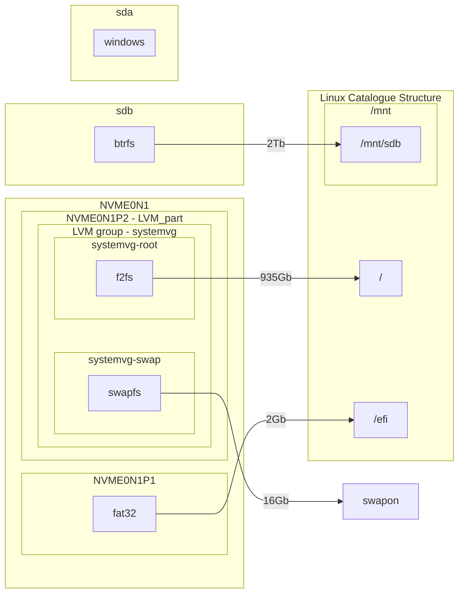

#### Диски:


## Создание разметки и разделов:
**Размечаем диск в gpt:**
```bash
parted /dev/nvme0n1 mklabel gpt
```
**Создаём 2 раздела:**
```bash
parted /dev/nvme0n1 mkpart '"EFI system partition"' fat32 2048s 2048MiB && \
parted /dev/nvme0n1 mkpart '"primary partition"' 2048MiB 100%
```
>[!Info]
>Очень важно, следите за размером секторов на диске! От этого зависит скорость доступа к диску. Если при создании раздела не соблюсти кратность сектора, то контроллер будет чаще обращаться к ячейкам, а значит увеличится и время доступа к данным. В данном случае, минимальный разрешённый сектор у меня 2048s(секторов).
>Дополнительно тут: https://wiki.archlinux.org/title/Parted_(%D0%A0%D1%83%D1%81%D1%81%D0%BA%D0%B8%D0%B9)#%D0%92%D1%8B%D1%80%D0%B0%D0%B2%D0%BD%D0%B8%D0%B2%D0%B0%D0%BD%D0%B8%D0%B5

>[!Info]
>Ещё интересная вещь, это указание размера разделов в процентах. Она очень удобна, когда нужно указать раздел от начала 0% или до конца 100%

**Назначаем флаги для разделов (необязательно, но пусть будет):**
```bash
parted /dev/nvme0n1 set 1 esp on && \
parted /dev/nvme0n1 set 2 LVM on
```
**Форматирование раздела под efi:**
```bash
mkfs.fat -F32 /dev/nvme0n1p1
```
## LUKS шифрование раздела с LVM томами:
LUKS шифрование даёт нам раздел, который полностью закрыт для просмотра, делая из раздела, по сути один большой файл. Его структура похожа на структуру обычного диска с разметкой диска, только вместо разметки диска, у нас заголовок LUKS и ещё есть отдельный раздел для хранения ключей, за счёт чего в LUKS  можно удобно менять пароли (в отличии от того же dm-decrypt, где ключ выбирается один на все файлы)
Подробнее о моём варианте шифрования можно почитать тут:
https://wiki.archlinux.org/title/Dm-crypt/Encrypting_an_entire_system#LVM_on_LUKS
**Проверяем модули на работоспособность:**
```bash
modprobe dm-crypt && \
modprobe dm-mod
```
**Шифруем диск в SHA 512:**
```bash
cryptsetup luksFormat -v -s 512 -h sha512 /dev/nvme0n1p2
```
**Открываем зашифрованный диск:**
```bash
cryptsetup luksOpen /dev/nvme0n1p2 LVM_part
```
**Создаём физический общий том:**
```bash
pvcreate /dev/mapper/LVM_part
```
**Создаём группу томов systemvg:**
```bashy
vgcreate systemvg /dev/mapper/LVM_part
```
**Создаём логический топ для swap на 16 gb в группе systemvg:**
```bash
lvcreate -L16G -n swap systemvg
```
**Создаём логический том для корневого раздела root на остальное место в группе systemvg:**
```bash
lvcreate -l 100%FREE -n root systemvg
```
>[!Info]
>Очень удобно создавать последний диск параметрической переменной 100%FREE, которая создаёт логический том из оставшегося места

**Экспортируем адреса группы томов и самих томов в переменные:**
```bash
export ROOT=/dev/systemvg/root SWAP=/dev/systemvg/swap
```

#### Настройка Trim для lvm:
**Сделать бэкап /etc/lvm/lvm.conf:**
```bash
cp /etc/lvm/lvm.conf /etc/lvm/lvm.conf.backup
```
**В /etc/lvm/lvm.conf расскомментить issue_discards = 1:**
```bash
sed -i 's/# issue_discards = 0/issue_discards = 1/g' -i /etc/lvm/lvm.conf
```

**Отмонтируем все тома и диски если LVM:**
```bash
umount -Rv /mnt &&\
swapoff /dev/systemvg/swap &&\
vgchange -an /dev/mapper/systemvg &&\
cryptsetup close LVM_part
```